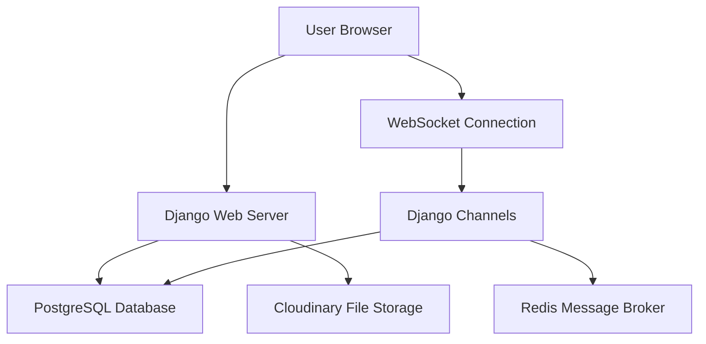
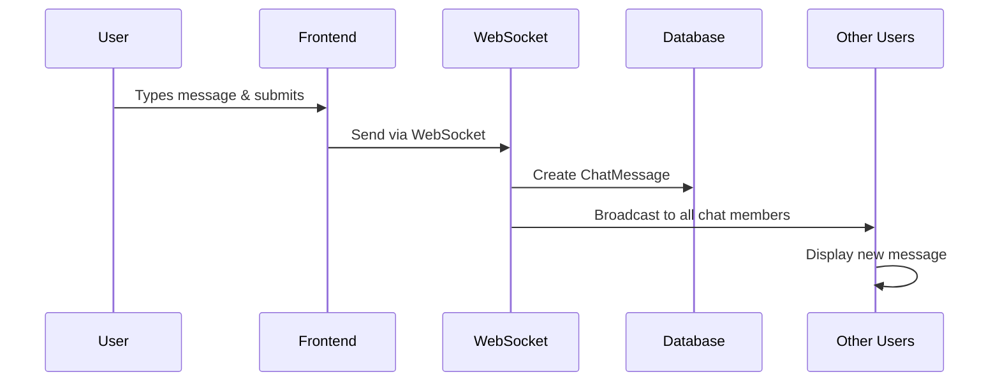
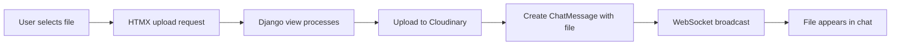

# 🐒 Monkey Snowfight Live Chat
## Complete Technical Documentation

---

## 📋 **Table of Contents**
- [High-Level Overview](#high-level-overview)
- [Technical Architecture](#technical-architecture)
- [Database Structure](#database-structure)
- [Real-Time Communication](#real-time-communication)
- [Message System](#message-system)
- [Online Status System](#online-status-system)
- [Chat Types](#chat-types)
- [File Upload System](#file-upload-system)
- [User Interface Components](#user-interface-components)
- [Performance Considerations](#performance-considerations)
- [Security & Permissions](#security--permissions)
- [Technology Stack](#technology-stack)
- [User Journey Examples](#user-journey-examples)
- [API Endpoints](#api-endpoints)
- [WebSocket Events](#websocket-events)

---

## 🎯 **High-Level Overview**

The Monkey Snowfight chat system enables real-time communication through three distinct conversation types:

| Chat Type | Description | Access Level |
|-----------|-------------|--------------|
| **🌍 Public Chat** | Global conversation everyone can join | Open to all users |
| **💬 Private Chats** | Direct messages between two users | Invitation only |
| **👥 Group Chats** | Named groups with multiple participants | Member-based (Users with URL) |

### **Key Features**
- ⚡ **Real-time messaging** with instant delivery
- 👀 **Live online status** indicators
- 📁 **File sharing** with cloud storage
- 📱 **Responsive design** for all devices
- 🔒 **Secure access control** and permissions
- 🔗 **Auto-link detection** with custom styling and click protection
- 📜 **Infinite scroll** with intelligent loading indicators
- 🎯 **Smart auto-scroll** with user behavior awareness
- ⏰ **Relative timestamps** with human-readable formatting
- 👤 **Interactive avatars** with profile navigation
- 🚫 **Multi-layer message validation** preventing empty submissions
- 🎨 **Advanced UI animations** and loading states
- ✉️ **Complete email verification system** with automatic login
- 👤 **Profile onboarding flow** with custom avatar support
- 🔐 **Enhanced authentication** with WebSocket session management
- 📧 **Professional email templates** with branded styling
- 🎨 **Semi-transparent design elements** with CSS custom properties

---

## 🏗️ **Technical Architecture**



### **Core Components**
1. **Django Backend** - Handles HTTP requests and business logic
2. **Django Channels** - Manages WebSocket connections for real-time features
3. **Redis** - Message broker for WebSocket communication
4. **PostgreSQL** - Primary data storage
5. **Cloudinary** - File upload and storage service
6. **Django Allauth** - Complete authentication system with email verification
7. **Gmail SMTP** - Production email delivery service
8. **Custom Email Templates** - Professional branded verification emails

---

## 🗄️ **Database Structure**

### **ChatRoom Model**
```python
class ChatRoom(models.Model):
    group_name = models.CharField(max_length=128, unique=True)  # UUID identifier
    groupchat_name = models.CharField(max_length=128, null=True, blank=True)  # Display name
    admin = models.ForeignKey(User, related_name='groupchats', blank=True, null=True)
    users_online = models.ManyToManyField(User, related_name='online_in_groups', blank=True)
    members = models.ManyToManyField(User, related_name='chat_groups', blank=True)
    is_private = models.BooleanField(default=False)
    created = models.DateTimeField(auto_now_add=True)
```

### **ChatMessage Model**
```python
class ChatMessage(models.Model):
    body = models.CharField(max_length=300, blank=True, null=True)
    file = CloudinaryField('file', blank=True, null=True)
    original_filename = models.CharField(max_length=255, blank=True, null=True)
    author = models.ForeignKey(User, on_delete=models.CASCADE)
    group = models.ForeignKey(ChatRoom, related_name='chat_messages', on_delete=models.CASCADE)
    created = models.DateTimeField(auto_now_add=True)
```

### **Profile Model**
```python
class Profile(models.Model):
    user = models.OneToOneField(User, on_delete=models.CASCADE)
    image = CloudinaryField('image', null=True, blank=True)
    displayname = models.CharField(max_length=20, null=True, blank=True)
    info = models.TextField(null=True, blank=True)
    
    @property
    def name(self):
        if self.displayname:
            return self.displayname
        return self.user.username
        
    @property
    def avatar(self):
        if self.image:
            return self.image.url
        return f'{settings.STATIC_URL}images/avatar.png'
```

### **Relationships**
- **One-to-Many**: ChatRoom → ChatMessages
- **Many-to-Many**: ChatRoom ↔ Users (members)
- **Many-to-Many**: ChatRoom ↔ Users (online users)
- **Foreign Key**: ChatMessage → User (author)
- **One-to-One**: User ↔ Profile (extended user data)
- **One-to-One**: User ↔ Profile.image (Cloudinary avatar storage)

---

## 🔐 **Authentication & User Management System**

### **Complete Email Verification Flow**

The system implements a comprehensive email verification process with automatic login and profile onboarding:

#### **Email Verification Configuration**
```python
# Django Allauth Settings
ACCOUNT_EMAIL_VERIFICATION = "mandatory"
ACCOUNT_EMAIL_REQUIRED = True
ACCOUNT_LOGIN_ON_EMAIL_CONFIRMATION = True
ACCOUNT_EMAIL_CONFIRMATION_AUTHENTICATED_REDIRECT_URL = '/profile/edit/?onboarding=true'
ACCOUNT_EMAIL_CONFIRMATION_ANONYMOUS_REDIRECT_URL = '/profile/edit/?onboarding=true'

# Gmail SMTP Configuration
EMAIL_BACKEND = 'django.core.mail.backends.smtp.EmailBackend'
EMAIL_HOST = 'smtp.gmail.com'
EMAIL_PORT = 587
EMAIL_USE_TLS = True
EMAIL_HOST_USER = 'monkeysnowfightgameandchat@gmail.com'
DEFAULT_FROM_EMAIL = 'monkeysnowfightgameandchat@gmail.com'
```

#### **Custom Email Confirmation View**
```python
class CustomConfirmEmailView(ConfirmEmailView):
    """Enhanced email confirmation with guaranteed auto-login"""
    
    def post(self, *args, **kwargs):
        # Confirm the email
        self.object = confirmation = self.get_object()
        confirmation.confirm(self.request)
        
        # Force login the user
        user = confirmation.email_address.user
        backend = get_backends()[0]
        login(self.request, user, backend=backend.__class__.__module__ + '.' + backend.__class__.__name__)
        
        # Redirect to profile onboarding
        return redirect(f"{reverse('profile-edit')}?onboarding=true")
```

### **Professional Email Templates**

#### **HTML Email Template**
```html
<!DOCTYPE html>
<html>
<head>
    <meta charset="utf-8">
    <title>Verify Your Monkey Snowfight Account</title>
    <style>
        body { font-family: Arial, sans-serif; background-color: #f0fafa; }
        .container { max-width: 600px; margin: 0 auto; background: white; }
        .header { background: rgb(95,185,225); color: white; padding: 20px; }
        .content { padding: 30px; }
        .button { 
            background: rgb(255,104,0); 
            color: white; 
            padding: 15px 30px; 
            text-decoration: none; 
            border-radius: 8px; 
            display: inline-block; 
        }
        .footer { background: #f8f9fa; padding: 20px; color: #6c757d; }
    </style>
</head>
<body>
    <div class="container">
        <div class="header">
            <h1>🐒 Welcome to Monkey Snowfight!</h1>
        </div>
        <div class="content">
            <p>Hi there!</p>
            <p>Thanks for signing up! Please verify your email address to complete your registration and start chatting with the community.</p>
            <p style="text-align: center; margin: 30px 0;">
                <a href="{{ activate_url }}" class="button">Verify Email Address</a>
            </p>
            <p><strong>What's next?</strong></p>
            <ul>
                <li>✅ Click the verification button above</li>
                <li>🎯 Complete your profile setup</li>
                <li>💬 Start chatting in our community</li>
                <li>🎮 Enjoy the Monkey Snowfight experience!</li>
            </ul>
        </div>
        <div class="footer">
            <p>If you didn't create an account, you can safely ignore this email.</p>
            <p>© 2024 Monkey Snowfight. Have fun and stay awesome! 🐒</p>
        </div>
    </div>
</body>
</html>
```

### **Profile Onboarding System**

#### **Enhanced Profile Model with Default Avatar**
```python
@property
def avatar(self):
    if self.image:
        return self.image.url
    return f'{settings.STATIC_URL}images/avatar.png'  # Default avatar for all new users
```

#### **Onboarding Flow Features**
- **Automatic Profile Creation**: Created via Django signals on user registration
- **Default Avatar System**: All users start with `static/images/avatar.png`
- **Onboarding Parameter**: `?onboarding=true` triggers welcome messaging
- **Custom Display Names**: Users can set personalized display names
- **Profile Information**: Rich text bio/info section
- **Avatar Upload**: Cloudinary integration for custom profile pictures

### **Enhanced WebSocket Authentication**

#### **Fixed Authentication Middleware**
```python
# Fixed WebSocket consumer authentication
async def connect(self):
    if not self.scope["user"] or self.scope["user"].is_anonymous:
        await self.close()
        return
    
    # Proper user handling without UserLazyObject errors
    user = self.scope["user"]
    if hasattr(user, '_wrapped'):
        user = user._wrapped
```

#### **Consistent Online User Management**
- **Authentication Guards**: All WebSocket connections validate authentication
- **Proper User Exclusion**: Consistent logic for removing offline users
- **Real-time Sync**: Online status synchronized across all connected clients
- **Memory Management**: Efficient cleanup of disconnected users

### **Password Security**

#### **Django Password Validators**
```python
AUTH_PASSWORD_VALIDATORS = [
    {
        'NAME': 'django.contrib.auth.password_validation.UserAttributeSimilarityValidator',
    },
    {
        'NAME': 'django.contrib.auth.password_validation.MinimumLengthValidator',
        # Default: 8 characters minimum
    },
    {
        'NAME': 'django.contrib.auth.password_validation.CommonPasswordValidator',
        # Prevents common passwords like "password123"
    },
    {
        'NAME': 'django.contrib.auth.password_validation.NumericPasswordValidator',
        # Prevents purely numeric passwords
    },
]
```

---

## 🎨 **Enhanced UI & Design System**

### **CSS Custom Properties & Design Tokens**
```css
:root {
  --blue-1: rgba(95,185,225);    /* Primary brand blue */
  --blue-2: rgba(191,230,255);   /* Light blue backgrounds */
  --blue-3: rgba(185,225,255);   /* Accent blue */
  --blue-font: rgba(38,87,136);  /* Text blue */
  --orange-1: rgb(255, 104, 0);  /* Primary orange accent */
}
```

### **Semi-Transparent Profile Design**
```css
.profile {
    background-color: rgba(95, 185, 225, 0.3);  /* Semi-transparent blue */
    border-radius: 1rem;
    backdrop-filter: blur(10px);  /* Modern glass effect */
}
```

### **Enhanced Form Styling**

#### **Custom Input Backgrounds**
```css
.form__input {
    background: rgba(224, 242, 245, 1);  /* Branded input background */
    color: var(--blue-font);
    border: none;
    border-radius: 0.5rem;
}

/* Override browser autofill styling */
input:-webkit-autofill {
    -webkit-box-shadow: 0 0 0 30px rgba(224, 242, 245, 1) inset !important;
    -webkit-text-fill-color: var(--blue-font) !important;
}
```

#### **Centered Authentication Buttons**
```html
<!-- Signup & Login forms with centered buttons -->
<div class="center-me">
    
        
    
</div>
```

#### **Enhanced Link Styling**
```css
.page-link {
    text-decoration: underline;
    color: var(--blue-font);
    transition: color 0.2s ease;
}

.page-link:hover {
    color: var(--orange-1);
}
```

---

## 🔌 **Real-Time Communication**

### **WebSocket Consumers**

#### **1. ChatroomConsumer** (`/ws/chatroom/{chatroom_name}`)
**Purpose**: Handles chat-specific real-time features

**Responsibilities**:
- 📨 Message broadcasting to chat participants
- 👥 Online user tracking per chat room
- 📊 Online count updates
- 🔄 Real-time status synchronization

**Connection Flow**:
```
User joins chat → WebSocket connects → User added to online list → 
Broadcast online count update → Accept connection
```

#### **2. OnlineStatusConsumer** (`/ws/online-status/`)
**Purpose**: Manages global online presence

**Responsibilities**:
- 🌐 Site-wide online user tracking
- 📈 Header online count updates
- 🔍 Chat dropdown status indicators
- 📱 Cross-chat presence synchronization

---

## 💬 **Message System**

### **Message Sending Process**


### **Message Types**
| Type | Content | Storage |
|------|---------|---------|
| **Text** | Plain text up to 300 characters | Database `body` field |
| **File** | Any file type with original filename | Cloudinary URL + metadata |
| **System** | Join/leave notifications | Generated dynamically |

### **Message Features**
- ⏰ **Smart timestamps** with relative time display ("2 minutes ago", "Yesterday")
- 👤 **Interactive author information** with clickable avatars leading to profiles
- 📎 **File attachments** with download links and original filename preservation
- 🔄 **Infinite scroll** with intelligent message history loading
- 📍 **Context-aware auto-scroll** respecting user behavior
- 🔗 **Automatic link detection** with enhanced styling and security
- 🚫 **Multi-layer validation** preventing blank message submission
- 📱 **Responsive message bubbles** with proper text wrapping
- ✨ **Loading animations** for better user experience

---

## 🟢 **Online Status System**

### **Three-Tier Status Tracking**

#### **1. Global Online Count (Header)**
- **Scope**: Entire website
- **Display**: "X online" in header
- **Updates**: Real-time via OnlineStatusConsumer
- **Purpose**: Show overall site activity

#### **2. Chat Room Online Count**
- **Scope**: Specific chat room
- **Display**: "X online" in chat info area
- **Updates**: When users join/leave chat
- **Purpose**: Show chat-specific activity

#### **3. Individual User Status**
- **Scope**: Per-user in specific contexts
- **Display**: Green/gray dots on avatars
- **Updates**: Real-time presence changes
- **Purpose**: Show who's actively participating

### **Status Indicators**
```css
.green-dot    /* Online - #22c55e */
.gray-dot     /* Offline - #6b7280 */
.graylight-dot /* Inactive - #d1d5db */
```

---

## 💭 **Chat Types**

### **🌍 Public Chat**
```yaml
Identifier: "public-chat"
Access: Open to all registered users
Membership: Automatic
Online Display: Count of users in public chat
Use Case: General community discussion
```

### **💬 Private Chats**
```yaml
Identifier: Auto-generated UUID
Access: Two specific users only
Membership: Automatic on first message
Online Display: Other user's status
Use Case: Direct messaging between users
Creation: Automatic when users interact
```

### **👥 Group Chats**
```yaml
Identifier: Auto-generated UUID
Access: Invited members only
Membership: Admin-controlled
Online Display: Member list with status dots
Use Case: Team discussions, friend groups
Creation: User-initiated with custom name
Requirements: Email verification for joining
```

---

## 📁 **File Upload System**

### **Upload Process**


### **File Handling**
- **Storage**: Cloudinary cloud service
- **Size Limits**: Configured per deployment
- **File Types**: All types supported
- **Security**: Access restricted to chat members
- **Metadata**: Original filename preserved

### **File Display**
- **Images**: Inline preview with download option
- **Documents**: Download link with file icon
- **Filename**: Original name displayed
- **Author**: Shows who uploaded the file

---

## 🎨 **Advanced UI Features**

### **🔄 Intelligent Auto-Scroll System**

The chat implements a sophisticated auto-scroll mechanism that respects user behavior:

#### **Smart Scroll Logic**
```javascript
// Tracks user position and intent
let wasAtBottom = true;         // Was user at bottom before new content?
let justSentMessage = false;    // Did this user just send a message?

function conditionalScrollToBottom() {
    if (wasAtBottom || justSentMessage) {
        scrollToBottom();  // Only scroll when appropriate
    }
}
```

#### **Scroll Behavior Rules**
| Scenario | Auto-Scroll | Reasoning |
|----------|-------------|-----------|
| **User sent message** | ✅ Always | User expects to see their own message |
| **User sent file** | ✅ Always | User expects to see their upload |
| **User at bottom + new message** | ✅ Yes | User is actively following conversation |
| **User scrolled up + new message** | ❌ No | User is reading history, don't interrupt |
| **Page load** | ✅ Always | Start at latest messages |

#### **Image-Aware Scrolling**
```javascript
function waitForImagesAndMaybeScroll(shouldScroll) {
    // Waits for all images to load before calculating scroll position
    // Prevents layout jumps from image loading
    const images = document.querySelectorAll('#chat_messages img');
    // Smart loading detection with fallback timing
}
```

### **📜 Advanced Infinite Scroll**

#### **Seamless History Loading**
- **Trigger**: Scroll to top of chat container
- **Loading State**: "Loading earlier messages..." with smooth animation
- **Position Preservation**: Maintains scroll position after new content loads
- **End Detection**: "Reached Beginning of Chat" when no more messages

#### **Smart Loading Indicators**
```javascript
// Dynamic loading messages with animations
const loadingDiv = document.createElement('div');
loadingDiv.className = 'loading-messages';
loadingDiv.textContent = 'Loading earlier messages...';

// Smooth animations with CSS transitions
@keyframes fadeInLoading {
    from { opacity: 0; transform: translateY(-30px); }
    to { opacity: 1; transform: translateY(0); }
}
```

#### **Observer Management**
- **Disconnect during loading**: Prevents auto-scroll interference
- **Reconnect after completion**: Resumes normal scroll behavior
- **Error handling**: Graceful fallback with observer restoration

### **🔗 Intelligent Auto-Link Detection**

#### **Advanced URL Recognition**
```javascript
// Sophisticated regex pattern matching
const urlPattern = /(https?:\/\/[^\s]+|www\.[a-zA-Z0-9][a-zA-Z0-9-]{1,61}[a-zA-Z0-9]\.[a-zA-Z]{2,}(?:\/[^\s]*)?|[a-zA-Z0-9][a-zA-Z0-9-]{1,61}[a-zA-Z0-9]\.[a-zA-Z]{2,}(?:\/[^\s]*)?)/gi;
```

#### **False Positive Prevention**
The system intelligently filters out non-URLs:
- **Decimal numbers**: `3.14`, `123.456` → Not converted
- **Version numbers**: `node.js`, `v2.1` → Not converted  
- **Object notation**: `user.password`, `data.length` → Not converted
- **Common words**: Extensive blacklist of programming terms
- **Invalid TLDs**: Filters domains with overly long extensions

#### **Enhanced Link Styling**
```css
.message-link {
    color: #2563eb;
    text-decoration: underline;
    text-underline-offset: 3px;
    transition: all 0.3s cubic-bezier(0.4, 0, 0.2, 1);
    padding: 2px 4px;
}

.message-link:hover {
    color: #ffffff;
    background: linear-gradient(135deg, #3b82f6 0%, #1d4ed8 100%);
    text-decoration: none;
    border-radius: 6px;
}
```

#### **Security Features**
- **External links**: `target="_blank"` for new tab opening
- **Security headers**: `rel="noopener noreferrer"` preventing window.opener access
- **Protocol handling**: Automatic `http://` prefix for domain-only URLs

### **⏰ Dynamic Timestamp System**

#### **Relative Time Display**
Messages show human-readable timestamps:
- **Recent**: "2 minutes ago", "1 hour ago"
- **Today**: "Today at 2:30 PM"
- **This week**: "Yesterday", "Monday"
- **Older**: "March 15, 2024"

#### **Responsive Timestamp Positioning**
- **Own messages**: Right-aligned below bubble
- **Other messages**: Center-aligned with subtle styling
- **Mobile optimization**: Timestamps hidden on small screens for space

### **👤 Interactive Avatar System**

#### **Clickable Profile Navigation**
```html
<a href="">
    
</a>
```

#### **Status Integration**
- **Online indicators**: Green dots for active users
- **Offline status**: Gray dots for inactive users
- **Positioning**: Absolute positioned status dots on avatars

### **🚫 Multi-Layer Message Validation**

#### **Three-Tier Validation System**

1. **Client-Side Validation**
```javascript
// Immediate feedback before submission
document.getElementById('chat_message_form').addEventListener('submit', function(e) {
    const messageInput = document.querySelector('#chat_message_form input[name="body"]');
    if (!messageInput.value.trim()) {
        e.preventDefault();
        return false;
    }
});
```

2. **Django Form Validation**
```python
def clean_body(self):
    body = self.cleaned_data.get('body')
    if not body or not body.strip():
        raise forms.ValidationError("Message cannot be empty.")
    return body.strip()
```

3. **WebSocket Consumer Validation**
```python
# Server-side validation in consumer
body = message.get('body', '').strip()
if not body:
    return  # Silently ignore empty messages
```

### **✨ Loading States & Animations**

#### **Smooth State Transitions**
- **Message appearance**: Fade-in animations for new messages
- **Loading indicators**: Pulsing animations during fetch operations
- **Image loading**: Progressive loading with placeholder states
- **Error states**: Graceful error messaging with retry options

#### **Performance Optimizations**
- **Mutation observers**: Efficient DOM change detection
- **Debounced updates**: Prevents excessive re-renders
- **Lazy loading**: Messages loaded on-demand during scroll
- **Memory management**: Automatic cleanup of event listeners

---

## 🎨 **User Interface Components**

### **Header Navigation**
```html
┌─────────────────────────────────────────────────┐
│ 🐒 Monkey Snowfight    [5 online] [Chat ▼] [User ▼] │
└─────────────────────────────────────────────────┘
```

**Features**:
- 🏠 **Brand logo** linking to home
- 📊 **Global online count** with real-time updates
- 💬 **Chat dropdown** showing all user's chats with status
- 👤 **User menu** with profile and settings

### **Enhanced Chat Interface**
```
┌─────────────────────────────────────────────────┐
│ Group Chat Name                    [Edit] [-]   │
├─────────────────────────────────────────────────┤
│ 👥 [●] Alice  [●] Bob  [○] Charlie  [3 online]  │
├─────────────────────────────────────────────────┤ ← Infinite scroll trigger
│ ⟳ Loading earlier messages...                   │ ← Loading indicator
│                                                 │
│  👤 Alice: Check out this site https://github.com │ ← Auto-linked URL
│      └─ 2 hours ago                             │ ← Relative timestamp
│                                                 │
│      You: Great! Just finished the project 📁   │ ← Your message (auto-scrolled)
│          └─ Just now                            │
│                                                 │
│  👤 Bob: Awesome work on user.password validation! │ ← No false link detection
│      └─ 1 minute ago                            │
│                                                 │ ← Smart scroll: stays here if user
│                                                 │   scrolled up, moves to bottom if
│                                                 │   user was at bottom
├─────────────────────────────────────────────────┤
│ [📎] Type your message...              [Send]   │ ← Validates empty messages
│ [Choose File] [filename.jpg]    [Send Attachment] │ ← File upload with preview
└─────────────────────────────────────────────────┘
```

#### **Interactive Elements**
- **👤 Clickable avatars** → Navigate to user profiles
- **🔗 Auto-detected links** → Open in new tabs with security headers
- **⏰ Dynamic timestamps** → Update in real-time
- **📁 File previews** → Inline image display, download links for others
- **🔄 Infinite scroll** → Seamless history loading with position preservation

### **Chat Info Bar Variations**

#### **Private Chat**
```
[●] Alice Johnson (@alice) - Shows other user's online status
```

#### **Group Chat**
```
👥 [●] Alice [●] Bob [○] Charlie [○] Dave - Member list with status
```

#### **Public Chat**
```
[●] 12 online - Count of users in public chat
```

---

## 🔧 **Advanced Technical Implementation**

### **Real-Time Link Processing**
```javascript
// Auto-link detection runs on multiple triggers
document.addEventListener('DOMContentLoaded', processAutoLinking);           // Page load
document.addEventListener('htmx:wsAfterMessage', processAutoLinking);        // New messages
const linkObserver = new MutationObserver(processAutoLinking);              // DOM changes
```

### **Scroll Position Management**
```javascript
// Sophisticated scroll tracking
function isAtBottom() {
    const container = document.getElementById('chat_container');
    const threshold = 150;  // 150px tolerance for "at bottom"
    return container.scrollTop + container.clientHeight >= 
           container.scrollHeight - threshold;
}

// Image-aware scrolling prevents layout jumps
function waitForImagesAndMaybeScroll(shouldScroll) {
    if (justSentMessage) shouldScroll = true;  // Override for own messages
    // Wait for all images to load before final scroll calculation
}
```

### **Observer Pattern Implementation**
```javascript
// Multiple observers for different concerns
const linkObserver = new MutationObserver(processAutoLinking);    // Link detection
const scrollObserver = new MutationObserver(conditionalScroll);   // Scroll management
const chatObserver = new MutationObserver(handleChatChanges);     // General updates

// Smart observer management during loading states
observer.disconnect();  // During infinite scroll loading
// ... load new content ...
observer.observe(chatMessages, { childList: true });  // Reconnect after
```

### **State Management**
```javascript
// Centralized state tracking
let wasAtBottom = true;          // User scroll position
let justSentMessage = false;     // Message origin tracking
let isLoading = false;           // Infinite scroll state
let noMoreMessages = false;      // End-of-history state
```

### **Error Handling & Resilience**
```javascript
// Graceful degradation for failed operations
.catch(() => {
    if (loadingDiv.parentNode) loadingDiv.parentNode.removeChild(loadingDiv);
    observer.observe(chatMessages, { childList: true });  // Always reconnect
    isLoading = false;  // Reset state
});
```

---

## ⚡ **Performance Considerations**

### **Current Optimizations Implemented**
1. **Smart Scroll Management**
   - Conditional auto-scroll prevents unnecessary DOM manipulation
   - Image-aware loading eliminates layout thrashing
   - Position preservation during infinite scroll
   - Efficient scroll threshold detection (150px tolerance)

2. **Efficient DOM Operations**
   - MutationObserver for minimal DOM querying
   - Observer disconnect/reconnect during bulk operations
   - Selective link processing (avoid re-processing existing links)
   - Debounced scroll event handling

3. **Intelligent Loading States**
   - Infinite scroll with smart batching
   - Loading indicators prevent duplicate requests
   - Memory-efficient message pagination
   - Proper cleanup of event listeners and observers

4. **Frontend Performance**
   - CSS animations with hardware acceleration
   - Efficient regex patterns for link detection
   - Minimal DOM queries with caching
   - Responsive design reducing mobile layout calculations

### **Current Bottlenecks**
1. **Database Query Complexity**
   - Multiple joins for online status checks
   - N+1 queries for member status updates
   - Complex filtering for chat dropdown

2. **WebSocket Update Frequency**
   - Every user join/leave triggers updates
   - Multiple consumers updating simultaneously
   - Template rendering on each update

3. **Scaling Limitations**
   - Database-based online tracking doesn't scale
   - Memory usage grows with concurrent users
   - Network overhead from frequent updates

### **Optimization Opportunities**
- **Redis Integration**: Fast in-memory online tracking
- **Query Optimization**: Reduce database hits
- **Caching Strategy**: Cache frequently accessed data
- **WebSocket Batching**: Group updates together

---

## 🔒 **Security & Permissions**

### **Access Control Matrix**
| Action | Public Chat | Private Chat | Group Chat |
|--------|-------------|--------------|------------|
| **View Messages** | All users | Members only | Members only |
| **Send Messages** | All users | Members only | Members only |
| **Upload Files** | All users | Members only | Members only |
| **Add Members** | N/A | N/A | Admin only |
| **Edit Settings** | N/A | N/A | Admin only |
| **Delete Chat** | N/A | N/A | Admin only |

### **Security Measures**
- 🔐 **Authentication required** for all chat access
- ✉️ **Mandatory email verification** for account activation
- 📧 **Professional email templates** preventing phishing confusion
- 🔄 **Automatic login** after email verification
- 🚫 **Member-only access** to private/group content
- 🛡️ **CSRF protection** on all forms
- 🔒 **Secure file uploads** with validation
- 🔐 **Password strength requirements** (8+ chars, no common passwords)
- 🌐 **WebSocket authentication** guards on all connections
- 🎯 **Input validation** on both client and server side

### **Data Privacy**
- **Private chats**: Only visible to participants
- **Group chats**: Only visible to members
- **Online status**: Shared only in relevant contexts
- **File access**: Restricted to chat members

---

## 🛠️ **Technology Stack**

### **Backend Technologies**
```yaml
Framework: Django 5.2.4
WebSockets: Django Channels
Database: PostgreSQL (Neon hosted)
Cache/Broker: Redis Cloud
File Storage: Cloudinary
Authentication: Django Allauth 65.9.0
Email Service: Gmail SMTP
User Profiles: Custom Profile model with Cloudinary integration
```

### **Frontend Technologies**
```yaml
Dynamic Updates: HTMX
Real-time: WebSockets
Styling: Custom CSS with CSS variables
UI Components: Django Allauth element system
Icons: Icons8
Fonts: VAG Rounded BT, Trade Gothic
```

### **Infrastructure**
```yaml
Hosting: Heroku
Database: Neon PostgreSQL
Redis: Redis Cloud
CDN: Cloudinary
SSL: Automatic HTTPS
Email: Gmail SMTP with App Passwords
Domain Management: Django Sites framework
```

---

## 👥 **User Journey Examples**

### **🆕 User Registration & Email Verification**
1. **Registration**: User submits signup form with email/username/password
2. **Account Creation**: Django creates User account but requires email verification
3. **Email Dispatch**: System sends professional HTML verification email via Gmail SMTP
4. **Email Reception**: User receives branded verification email with CTA button
5. **Verification Click**: User clicks "Verify Email Address" button in email
6. **Auto-Login**: Custom view automatically logs user in after verification
7. **Profile Onboarding**: User redirected to profile edit with `?onboarding=true`
8. **Profile Setup**: User completes display name, bio, and avatar upload
9. **Chat Access**: User can now access all chat features

### **🔄 Starting a Private Chat**
1. **Discovery**: User clicks on another user's profile/username
2. **System Check**: Backend checks if private chat exists between users
3. **Chat Creation**: If none exists, creates new ChatRoom with `is_private=True`
4. **Membership**: Both users automatically added as members
5. **Navigation**: User redirected to chat interface
6. **Connection**: WebSocket established for real-time updates
7. **Status Update**: Online presence synchronized

### **👥 Joining a Group Chat**
1. **Invitation**: User receives invite link or finds public group
2. **Verification Check**: System validates email verification status
3. **Access Grant**: If verified, user added to chat members
4. **History Access**: User can now see previous messages
5. **Participation**: User can send messages and files
6. **Status Broadcast**: Online status updated across all members

### **📁 Sending a File**
1. **Selection**: User clicks file upload button in chat
2. **Upload**: File uploaded to Cloudinary via HTMX
3. **Message Creation**: ChatMessage created with file reference
4. **Broadcasting**: WebSocket sends file message to all members
5. **Display**: File appears with download link for all users
6. **Notification**: Real-time notification to offline users

### **🔔 Real-time Message Flow**
1. **Composition**: User types message in chat input
2. **Submission**: Form submitted via WebSocket
3. **Processing**: Server creates ChatMessage in database
4. **Broadcasting**: Message sent to all connected chat members
5. **Rendering**: Message appears instantly in all user interfaces
6. **Persistence**: Message stored for future retrieval

---

## 🌐 **API Endpoints**

### **Chat Management**
```python
# View chat room
GET /chat/{chatroom_name}/

# Create group chat
POST /chat/new/

# Edit group chat (admin only)
GET/POST /chat/{chatroom_name}/edit/

# Delete group chat (admin only)
POST /chat/{chatroom_name}/delete/

# Leave chat room
POST /chat/{chatroom_name}/leave/

# Start private chat
GET /chat/private/{username}/
```

### **Message Operations**
```python
# Load older messages (infinite scroll)
GET /chat/older/{chatroom_name}/?offset={number}

# Upload file to chat
POST /chat/upload/{chatroom_name}/
```

### **WebSocket Endpoints**
```python
# Chat room connection
WS /ws/chatroom/{chatroom_name}/

# Global online status
WS /ws/online-status/
```

---

## 📡 **WebSocket Events**

### **ChatroomConsumer Events**

#### **Incoming Events**
```javascript
// Send message
{
  "type": "message",
  "body": "Hello everyone!"
}

// File upload notification
{
  "type": "file_upload",
  "file_id": 123
}
```

#### **Outgoing Events**
```javascript
// New message broadcast
{
  "type": "message_handler",
  "message_id": 456,
  "html": "<div class='message'>...</div>"
}

// Online count update
{
  "type": "online_count_handler", 
  "online_count": 5,
  "html": "<span>5 online</span>"
}
```

### **OnlineStatusConsumer Events**

#### **Outgoing Events**
```javascript
// Global status update
{
  "type": "online_status_handler",
  "html": "<div>12 online</div><ul>...</ul>"
}

// Chat indicators update
{
  "type": "chat_indicators",
  "chat_counts": {
    "public-chat": 5,
    "group-abc123": 3
  }
}
```

---

## 🚀 **Recent Enhancements Completed**

### **✅ Authentication & User Management**
- [x] Complete email verification system with mandatory verification
- [x] Professional branded email templates (HTML + text)
- [x] Automatic login after email verification
- [x] Profile onboarding flow with custom messaging
- [x] Default avatar system for all new users
- [x] Enhanced Profile model with display names and bio
- [x] Password strength validation (Django validators)
- [x] WebSocket authentication fixes and session management

### **✅ UI/UX Improvements**
- [x] Semi-transparent profile backgrounds with CSS variables
- [x] Enhanced form styling with branded colors
- [x] Centered authentication buttons for better UX
- [x] Custom link styling with hover effects
- [x] Browser autofill override for consistent input styling
- [x] Responsive design improvements for mobile devices

### **✅ Technical Infrastructure**
- [x] Gmail SMTP integration for production email delivery
- [x] Heroku deployment with environment variable configuration
- [x] Django Sites framework for proper domain management
- [x] Cloudinary integration for profile avatar uploads
- [x] Enhanced WebSocket consumer error handling

---

## 🚀 **Future Enhancements**

### **Performance Improvements**
- [ ] Redis-based online tracking for instant updates
- [ ] Message pagination optimization
- [ ] WebSocket connection pooling
- [ ] Database query optimization

### **Feature Additions**
- [ ] Message reactions (emoji responses)
- [ ] Typing indicators
- [ ] Message search functionality  
- [ ] Push notifications for offline users
- [ ] Voice/video calling integration
- [ ] Message threading/replies
- [ ] Link previews with metadata
- [ ] Advanced message formatting (markdown support)
- [ ] Message editing and deletion
- [ ] Read receipts and delivery status

### **UI/UX Enhancements**
- [ ] Enhanced auto-link previews with thumbnails
- [ ] Smart timestamp grouping (day separators)
- [ ] Advanced infinite scroll with virtual scrolling
- [ ] Gesture-based navigation for mobile
- [ ] Keyboard shortcuts for power users
- [ ] Message search with highlighting
- [ ] Improved loading skeletons

### **User Experience**
- [ ] Dark mode theme
- [ ] Custom emoji support
- [ ] Message formatting (bold, italic)
- [ ] Drag-and-drop file uploads
- [ ] Mobile app development

---

## 📞 **Support & Maintenance**

### **Monitoring**
- **Error Tracking**: Django logging system
- **Performance**: Database query monitoring
- **Uptime**: WebSocket connection health checks
- **Usage**: Chat activity analytics

### **Backup Strategy**
- **Database**: Automated PostgreSQL backups
- **Files**: Cloudinary redundancy
- **Configuration**: Version controlled settings

---

*This documentation covers the complete Monkey Snowfight chat system as of the current implementation. For technical support or feature requests, please refer to the development team.*