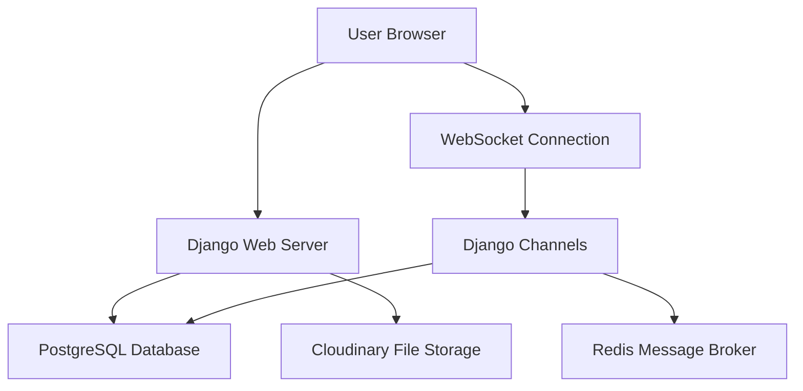
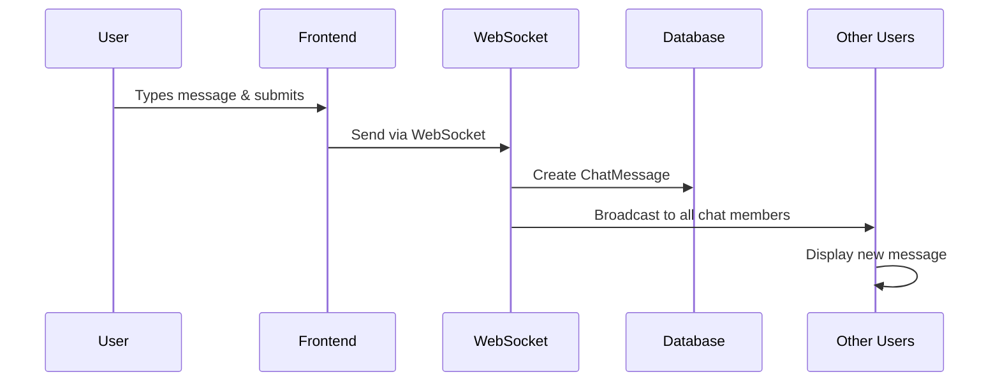
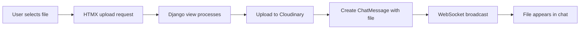

# 🐒 Monkey Snowfight Live Chat
## Complete Technical Documentation

---

## 📋 **Table of Contents**
- [High-Level Overview](#high-level-overview)
- [Technical Architecture](#technical-architecture)
- [Database Structure](#database-structure)
- [Real-Time Communication](#real-time-communication)
- [Message System](#message-system)
- [Online Status System](#online-status-system)
- [Chat Types](#chat-types)
- [File Upload System](#file-upload-system)
- [User Interface Components](#user-interface-components)
- [Performance Considerations](#performance-considerations)
- [Security & Permissions](#security--permissions)
- [Technology Stack](#technology-stack)
- [User Journey Examples](#user-journey-examples)
- [API Endpoints](#api-endpoints)
- [WebSocket Events](#websocket-events)

---

## 🎯 **High-Level Overview**

The Monkey Snowfight chat system enables real-time communication through three distinct conversation types:

| Chat Type | Description | Access Level |
|-----------|-------------|--------------|
| **🌍 Public Chat** | Global conversation everyone can join | Open to all users |
| **💬 Private Chats** | Direct messages between two users | Invitation only |
| **👥 Group Chats** | Named groups with multiple participants | Member-based (Users with URL) |

### **Key Features**
- ⚡ **Real-time messaging** with instant delivery
- 👀 **Live online status** indicators
- 📁 **File sharing** with cloud storage
- 📱 **Responsive design** for all devices
- 🔒 **Secure access control** and permissions

---

## 🏗️ **Technical Architecture**



### **Core Components**
1. **Django Backend** - Handles HTTP requests and business logic
2. **Django Channels** - Manages WebSocket connections for real-time features
3. **Redis** - Message broker for WebSocket communication
4. **PostgreSQL** - Primary data storage
5. **Cloudinary** - File upload and storage service

---

## 🗄️ **Database Structure**

### **ChatRoom Model**
```python
class ChatRoom(models.Model):
    group_name = models.CharField(max_length=128, unique=True)  # UUID identifier
    groupchat_name = models.CharField(max_length=128, null=True, blank=True)  # Display name
    admin = models.ForeignKey(User, related_name='groupchats', blank=True, null=True)
    users_online = models.ManyToManyField(User, related_name='online_in_groups', blank=True)
    members = models.ManyToManyField(User, related_name='chat_groups', blank=True)
    is_private = models.BooleanField(default=False)
    created = models.DateTimeField(auto_now_add=True)
```

### **ChatMessage Model**
```python
class ChatMessage(models.Model):
    body = models.CharField(max_length=300, blank=True, null=True)
    file = CloudinaryField('file', blank=True, null=True)
    original_filename = models.CharField(max_length=255, blank=True, null=True)
    author = models.ForeignKey(User, on_delete=models.CASCADE)
    group = models.ForeignKey(ChatRoom, related_name='chat_messages', on_delete=models.CASCADE)
    created = models.DateTimeField(auto_now_add=True)
```

### **Relationships**
- **One-to-Many**: ChatRoom → ChatMessages
- **Many-to-Many**: ChatRoom ↔ Users (members)
- **Many-to-Many**: ChatRoom ↔ Users (online users)
- **Foreign Key**: ChatMessage → User (author)

---

## 🔌 **Real-Time Communication**

### **WebSocket Consumers**

#### **1. ChatroomConsumer** (`/ws/chatroom/{chatroom_name}`)
**Purpose**: Handles chat-specific real-time features

**Responsibilities**:
- 📨 Message broadcasting to chat participants
- 👥 Online user tracking per chat room
- 📊 Online count updates
- 🔄 Real-time status synchronization

**Connection Flow**:
```
User joins chat → WebSocket connects → User added to online list → 
Broadcast online count update → Accept connection
```

#### **2. OnlineStatusConsumer** (`/ws/online-status/`)
**Purpose**: Manages global online presence

**Responsibilities**:
- 🌐 Site-wide online user tracking
- 📈 Header online count updates
- 🔍 Chat dropdown status indicators
- 📱 Cross-chat presence synchronization

---

## 💬 **Message System**

### **Message Sending Process**


### **Message Types**
| Type | Content | Storage |
|------|---------|---------|
| **Text** | Plain text up to 300 characters | Database `body` field |
| **File** | Any file type with original filename | Cloudinary URL + metadata |
| **System** | Join/leave notifications | Generated dynamically |

### **Message Features**
- ⏰ **Timestamps** with relative time display
- 👤 **Author information** with avatar and username
- 📎 **File attachments** with download links
- 🔄 **Infinite scroll** for message history
- 📍 **Auto-scroll** to latest messages

---

## 🟢 **Online Status System**

### **Three-Tier Status Tracking**

#### **1. Global Online Count (Header)**
- **Scope**: Entire website
- **Display**: "X online" in header
- **Updates**: Real-time via OnlineStatusConsumer
- **Purpose**: Show overall site activity

#### **2. Chat Room Online Count**
- **Scope**: Specific chat room
- **Display**: "X online" in chat info area
- **Updates**: When users join/leave chat
- **Purpose**: Show chat-specific activity

#### **3. Individual User Status**
- **Scope**: Per-user in specific contexts
- **Display**: Green/gray dots on avatars
- **Updates**: Real-time presence changes
- **Purpose**: Show who's actively participating

### **Status Indicators**
```css
.green-dot    /* Online - #22c55e */
.gray-dot     /* Offline - #6b7280 */
.graylight-dot /* Inactive - #d1d5db */
```

---

## 💭 **Chat Types**

### **🌍 Public Chat**
```yaml
Identifier: "public-chat"
Access: Open to all registered users
Membership: Automatic
Online Display: Count of users in public chat
Use Case: General community discussion
```

### **💬 Private Chats**
```yaml
Identifier: Auto-generated UUID
Access: Two specific users only
Membership: Automatic on first message
Online Display: Other user's status
Use Case: Direct messaging between users
Creation: Automatic when users interact
```

### **👥 Group Chats**
```yaml
Identifier: Auto-generated UUID
Access: Invited members only
Membership: Admin-controlled
Online Display: Member list with status dots
Use Case: Team discussions, friend groups
Creation: User-initiated with custom name
Requirements: Email verification for joining
```

---

## 📁 **File Upload System**

### **Upload Process**


### **File Handling**
- **Storage**: Cloudinary cloud service
- **Size Limits**: Configured per deployment
- **File Types**: All types supported
- **Security**: Access restricted to chat members
- **Metadata**: Original filename preserved

### **File Display**
- **Images**: Inline preview with download option
- **Documents**: Download link with file icon
- **Filename**: Original name displayed
- **Author**: Shows who uploaded the file

---

## 🎨 **User Interface Components**

### **Header Navigation**
```html
┌─────────────────────────────────────────────────┐
│ 🐒 Monkey Snowfight    [5 online] [Chat ▼] [User ▼] │
└─────────────────────────────────────────────────┘
```

**Features**:
- 🏠 **Brand logo** linking to home
- 📊 **Global online count** with real-time updates
- 💬 **Chat dropdown** showing all user's chats with status
- 👤 **User menu** with profile and settings

### **Chat Interface**
```
┌─────────────────────────────────────────────────┐
│ Group Chat Name                    [Edit] [⚙️]  │
├─────────────────────────────────────────────────┤
│ 👥 [●] Alice  [●] Bob  [○] Charlie  [3 online]  │
├─────────────────────────────────────────────────┤
│                                                 │
│  [👤] Alice: Hey everyone! How's it going?      │
│                                                 │
│      You: Great! Just finished the project 📁   │
│                                                 │
│  [👤] Bob: Awesome work! 👏                     │
│                                                 │
├─────────────────────────────────────────────────┤
│ [📎] Type your message...              [Send]   │
└─────────────────────────────────────────────────┘
```

### **Chat Info Bar Variations**

#### **Private Chat**
```
[●] Alice Johnson (@alice) - Shows other user's online status
```

#### **Group Chat**
```
👥 [●] Alice [●] Bob [○] Charlie [○] Dave - Member list with status
```

#### **Public Chat**
```
[●] 12 online - Count of users in public chat
```

---

## ⚡ **Performance Considerations**

### **Current Bottlenecks**
1. **Database Query Complexity**
   - Multiple joins for online status checks
   - N+1 queries for member status updates
   - Complex filtering for chat dropdown

2. **WebSocket Update Frequency**
   - Every user join/leave triggers updates
   - Multiple consumers updating simultaneously
   - Template rendering on each update

3. **Scaling Limitations**
   - Database-based online tracking doesn't scale
   - Memory usage grows with concurrent users
   - Network overhead from frequent updates

### **Optimization Opportunities**
- **Redis Integration**: Fast in-memory online tracking
- **Query Optimization**: Reduce database hits
- **Caching Strategy**: Cache frequently accessed data
- **WebSocket Batching**: Group updates together

---

## 🔒 **Security & Permissions**

### **Access Control Matrix**
| Action | Public Chat | Private Chat | Group Chat |
|--------|-------------|--------------|------------|
| **View Messages** | All users | Members only | Members only |
| **Send Messages** | All users | Members only | Members only |
| **Upload Files** | All users | Members only | Members only |
| **Add Members** | N/A | N/A | Admin only |
| **Edit Settings** | N/A | N/A | Admin only |
| **Delete Chat** | N/A | N/A | Admin only |

### **Security Measures**
- 🔐 **Authentication required** for all chat access
- ✉️ **Email verification** required for group chats
- 🚫 **Member-only access** to private/group content
- 🛡️ **CSRF protection** on all forms
- 🔒 **Secure file uploads** with validation

### **Data Privacy**
- **Private chats**: Only visible to participants
- **Group chats**: Only visible to members
- **Online status**: Shared only in relevant contexts
- **File access**: Restricted to chat members

---

## 🛠️ **Technology Stack**

### **Backend Technologies**
```yaml
Framework: Django 5.2.4
WebSockets: Django Channels
Database: PostgreSQL (Neon hosted)
Cache/Broker: Redis Cloud
File Storage: Cloudinary
Authentication: Django Allauth
```

### **Frontend Technologies**
```yaml
Dynamic Updates: HTMX
Real-time: WebSockets
Styling: Tailwind CSS (custom build)
Icons: Icons8
Fonts: VAG Rounded BT
```

### **Infrastructure**
```yaml
Hosting: TBD
Database: Neon PostgreSQL
Redis: Redis Cloud
CDN: Cloudinary
SSL: Automatic HTTPS
```

---

## 👥 **User Journey Examples**

### **🔄 Starting a Private Chat**
1. **Discovery**: User clicks on another user's profile/username
2. **System Check**: Backend checks if private chat exists between users
3. **Chat Creation**: If none exists, creates new ChatRoom with `is_private=True`
4. **Membership**: Both users automatically added as members
5. **Navigation**: User redirected to chat interface
6. **Connection**: WebSocket established for real-time updates
7. **Status Update**: Online presence synchronized

### **👥 Joining a Group Chat**
1. **Invitation**: User receives invite link or finds public group
2. **Verification Check**: System validates email verification status
3. **Access Grant**: If verified, user added to chat members
4. **History Access**: User can now see previous messages
5. **Participation**: User can send messages and files
6. **Status Broadcast**: Online status updated across all members

### **📁 Sending a File**
1. **Selection**: User clicks file upload button in chat
2. **Upload**: File uploaded to Cloudinary via HTMX
3. **Message Creation**: ChatMessage created with file reference
4. **Broadcasting**: WebSocket sends file message to all members
5. **Display**: File appears with download link for all users
6. **Notification**: Real-time notification to offline users

### **🔔 Real-time Message Flow**
1. **Composition**: User types message in chat input
2. **Submission**: Form submitted via WebSocket
3. **Processing**: Server creates ChatMessage in database
4. **Broadcasting**: Message sent to all connected chat members
5. **Rendering**: Message appears instantly in all user interfaces
6. **Persistence**: Message stored for future retrieval

---

## 🌐 **API Endpoints**

### **Chat Management**
```python
# View chat room
GET /chat/{chatroom_name}/

# Create group chat
POST /chat/new/

# Edit group chat (admin only)
GET/POST /chat/{chatroom_name}/edit/

# Delete group chat (admin only)
POST /chat/{chatroom_name}/delete/

# Leave chat room
POST /chat/{chatroom_name}/leave/

# Start private chat
GET /chat/private/{username}/
```

### **Message Operations**
```python
# Load older messages (infinite scroll)
GET /chat/older/{chatroom_name}/?offset={number}

# Upload file to chat
POST /chat/upload/{chatroom_name}/
```

### **WebSocket Endpoints**
```python
# Chat room connection
WS /ws/chatroom/{chatroom_name}/

# Global online status
WS /ws/online-status/
```

---

## 📡 **WebSocket Events**

### **ChatroomConsumer Events**

#### **Incoming Events**
```javascript
// Send message
{
  "type": "message",
  "body": "Hello everyone!"
}

// File upload notification
{
  "type": "file_upload",
  "file_id": 123
}
```

#### **Outgoing Events**
```javascript
// New message broadcast
{
  "type": "message_handler",
  "message_id": 456,
  "html": "<div class='message'>...</div>"
}

// Online count update
{
  "type": "online_count_handler", 
  "online_count": 5,
  "html": "<span>5 online</span>"
}
```

### **OnlineStatusConsumer Events**

#### **Outgoing Events**
```javascript
// Global status update
{
  "type": "online_status_handler",
  "html": "<div>12 online</div><ul>...</ul>"
}

// Chat indicators update
{
  "type": "chat_indicators",
  "chat_counts": {
    "public-chat": 5,
    "group-abc123": 3
  }
}
```

---

## 🚀 **Future Enhancements**

### **Performance Improvements**
- [ ] Redis-based online tracking for instant updates
- [ ] Message pagination optimization
- [ ] WebSocket connection pooling
- [ ] Database query optimization

### **Feature Additions**
- [ ] Message reactions (emoji responses)
- [ ] Typing indicators
- [ ] Message search functionality
- [ ] Push notifications for offline users
- [ ] Voice/video calling integration
- [ ] Message threading/replies

### **User Experience**
- [ ] Dark mode theme
- [ ] Custom emoji support
- [ ] Message formatting (bold, italic)
- [ ] Drag-and-drop file uploads
- [ ] Mobile app development

---

## 📞 **Support & Maintenance**

### **Monitoring**
- **Error Tracking**: Django logging system
- **Performance**: Database query monitoring
- **Uptime**: WebSocket connection health checks
- **Usage**: Chat activity analytics

### **Backup Strategy**
- **Database**: Automated PostgreSQL backups
- **Files**: Cloudinary redundancy
- **Configuration**: Version controlled settings

---

*This documentation covers the complete Monkey Snowfight chat system as of the current implementation. For technical support or feature requests, please refer to the development team.*